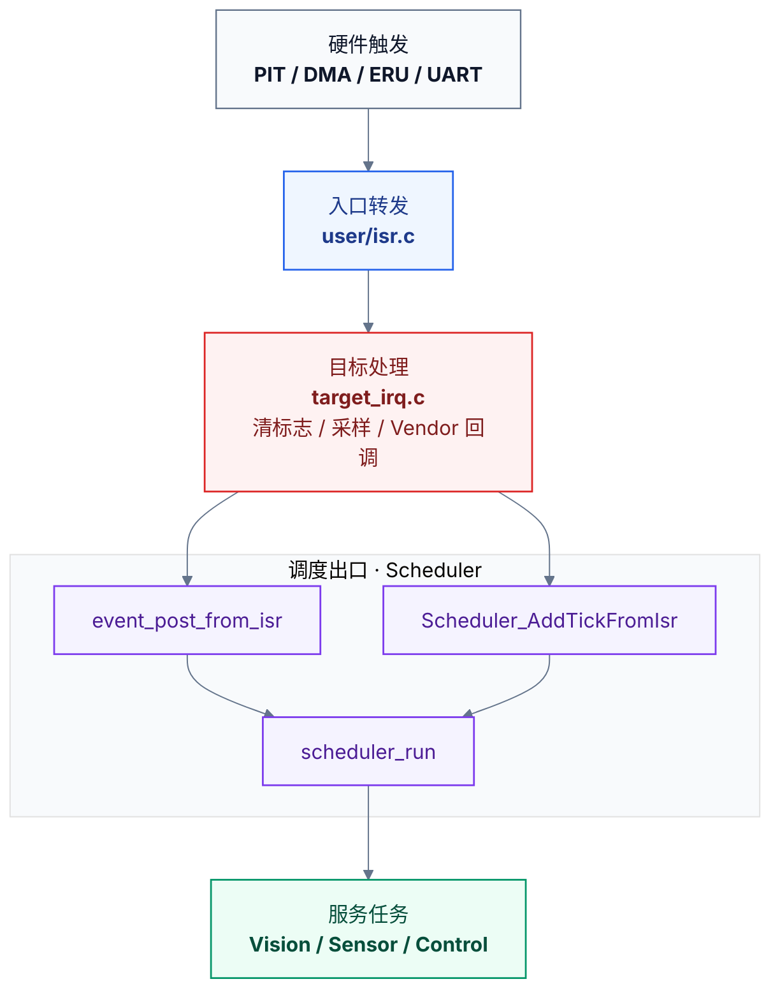

# GS_Smart_car

**智能车固件（当前目标：AURIX TC264D）**

本工程面向四轮舵机镜头车，当前目标平台为 Infineon AURIX TC264D，底层使用逐飞 SEEKFREE SDK 与 Infineon iLLD。工程采用事件驱动协作调度与链接期端口替换：业务层不包含 Vendor 头文件，不依赖具体 MCU，也不引入运行期 ops 注册或平台 dispatch 回环。


## Architecture

```mermaid
%%{init: {"theme": "base", "themeVariables": {"fontFamily": "Inter, Microsoft YaHei, Arial", "primaryBorderColor": "#CBD5E1", "lineColor": "#64748B", "tertiaryColor": "#F8FAFC"}}}%%
flowchart LR
    ENTRY["入口层<br/><b>SDK Entry</b><br/>cpu0_main / user/isr"]
    SYSTEM["系统层<br/><b>System</b><br/>boot / board / scheduler"]
    APP["应用层<br/><b>App</b><br/>task table"]
    SERVICE["服务层<br/><b>Service</b><br/>vision / sensor / control"]
    BSP["设备层<br/><b>BSP / Driver</b><br/>motor / servo / display"]
    PLATFORM["平台契约<br/><b>Platform</b><br/>port_if.h"]
    TARGET["目标适配<br/><b>Target</b><br/>port / board map / irq"]
    VENDOR["厂家底座<br/><b>Vendor</b><br/>SEEKFREE SDK + iLLD"]

    ENTRY --> SYSTEM --> APP --> SERVICE --> BSP --> PLATFORM --> TARGET --> VENDOR

    classDef entry fill:#F8FAFC,stroke:#64748B,color:#0F172A,stroke-width:1.2px;
    classDef system fill:#EFF6FF,stroke:#2563EB,color:#1E3A8A,stroke-width:1.4px;
    classDef app fill:#ECFDF5,stroke:#059669,color:#064E3B,stroke-width:1.4px;
    classDef service fill:#FFF7ED,stroke:#EA580C,color:#7C2D12,stroke-width:1.4px;
    classDef bsp fill:#F0FDFA,stroke:#0D9488,color:#134E4A,stroke-width:1.4px;
    classDef platform fill:#F5F3FF,stroke:#7C3AED,color:#4C1D95,stroke-width:1.4px;
    classDef target fill:#FEF2F2,stroke:#DC2626,color:#7F1D1D,stroke-width:1.4px;
    classDef vendor fill:#F9FAFB,stroke:#6B7280,color:#111827,stroke-width:1.2px;

    class ENTRY entry
    class SYSTEM system
    class APP app
    class SERVICE service
    class BSP bsp
    class PLATFORM platform
    class TARGET target
    class VENDOR vendor
```



## Layer Rules

| Layer | Responsibility | Boundary |
|:--|:--|:--|
| App | 注册应用任务，描述产品运行节奏 | 不直接访问 BSP/Vendor |
| Service | 视觉、传感、控制、诊断策略 | 不包含 MCU/Vendor 头 |
| BSP | 电机、舵机、显示、蜂鸣器、输入动作封装 | 只调用 `port_if.h` |
| Platform | 稳定端口契约：`SystemPort_*`、`McuIo_*`、`Device_*`、`SensorHal_*` | 不出现芯片专有类型 |
| Target | 当前 MCU 端口实现、资源映射、中断适配 | 唯一可调用 Vendor 的业务侧适配层 |
| Vendor | SEEKFREE SDK 与 Infineon iLLD | 默认只读 |

## IRQ Flow



ISR 只做短路径处理：清中断标志、必要采样、调用 Vendor 回调、投递事件或 tick。视觉、控制、显示等耗时逻辑全部回到主循环调度执行。`scheduler_run()` 采用分阶段执行：先处理传感事件，再处理 10ms 快速周期任务，随后处理摄像头帧等普通事件，最后处理慢速诊断任务，避免摄像头帧处理同轮阻塞控制输出。

## Data Flow

```text
PIT encoder ISR -> target_irq.c accumulates encoder window
                -> EVT_ENCODER_50MS
                -> SensorService_ProcessEncoder50ms()
                -> SensorHal_EncoderTakeSnapshot()

Camera DMA ISR  -> EVT_CAM_FRAME
                -> Vision task updates vision snapshots
                -> Control 10ms task reads latest snapshot on its next period

Gyro PIT ISR    -> Scheduler_AddTickFromIsr()
                -> EVT_GYRO_10MS counted event
                -> SensorService_ProcessGyro10ms()
```

Service 层只能通过 Platform 契约读取硬件采样快照。编码器窗口由当前 target 在中断侧维护，并以 `SensorHal_EncoderTakeSnapshot()` 暴露给传感服务；Scheduler 只负责事件与任务调度，不再承载编码器窗口接口。

## Repository Map

```text
code/
  app/                    应用任务表和任务注册
  service/                vision / sensor / control / diagnostics
  bsp/                    motor / servo / display / input / buzzer
  platform/               port_if.h / sensor_hal.h，稳定平台契约
  target/tc264/           当前目标端口、板级映射、中断适配
  system/                 启动编排、板级初始化
  scheduler/              事件标志和协作式调度器
  config/                 产品参数和 SMARTCAR_* 资源 ID
user/                     当前 SDK 入口层
libraries/                Vendor SDK
```

## Build

使用 AURIX Development Studio 构建：

```text
AURIX Development Studio -> Open Projects -> Build Project
```

本仓库不维护 host smoke tests、unit tests 或测试脚本；不要重新引入 `tests/`、`tests/smoke/`、`scripts/check_syntax.ps1` 或同类 host guard。

## MCU Porting

更换 MCU 时只替换目标端口与 Vendor 工程配置，业务层保持不动。

1. 新增 `code/target/<target>/`。
2. 提供 `target_port.c`，实现 `port_if.h` 中的 `SystemPort_*`、`McuIo_*`、`Device_*`。
3. 提供 `target_board_map.c/.h`，完成 `SMARTCAR_*` 到新 MCU 引脚、定时器、串口、DMA 的映射。
4. 提供 `target_irq.c/.h` 与 `target_irq_config.h`，完成目标中断适配并直接投递 scheduler event/tick。
5. 更新 IDE 工程，只编译当前 target 和对应 Vendor SDK，避免多个 target 同时定义端口符号。
6. 保持 `app/`、`service/`、`bsp/`、`scheduler/`、`system/` 不包含 Vendor 头或 target 私有头。

禁止回退到运行期 ops 注册、旧 PAL 兼容层、IRQ fact/router 或平台 dispatch 文件。

## Known Constraints

- `libraries/` 为 Vendor SDK，默认只读。
- Service、App、System、Scheduler 公共头不包含 `target/*`、`zf_common_headfile.h` 或 `Ifx*` 头。
- 中断适配层可以调用 Vendor 和 Platform，但只向 Scheduler 投递事件或 tick，不承载业务控制逻辑。
- 本仓库不维护 host smoke/unit test runner；语法检查仅作为本地临时验证命令执行，不新增测试目录或脚本。

## Documentation

非 Vendor 的 `.c` / `.h` 文件保持 Doxygen 文件头与函数注释同步；逻辑注释使用中文，文件头结构和分区标题保持工程统一风格。`libraries/` 下 Vendor 文件保留原始头部，默认不改。

## Commit Format

```text
type(scope): 中文描述
```

常用 scope：`app`、`service`、`bsp`、`platform`、`target`、`system`、`scheduler`、`build`、`docs`。

## License

Vendor SDK 遵循 `libraries/` 下 SEEKFREE 与 Infineon 原始许可证；项目代码保持现有版权和许可证声明。
