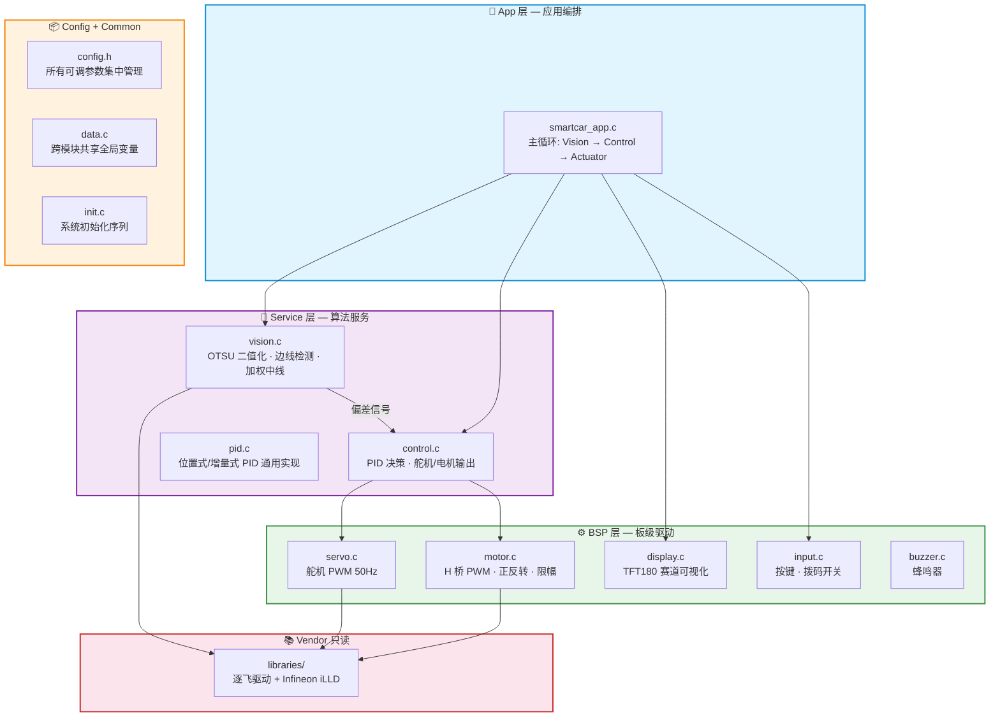
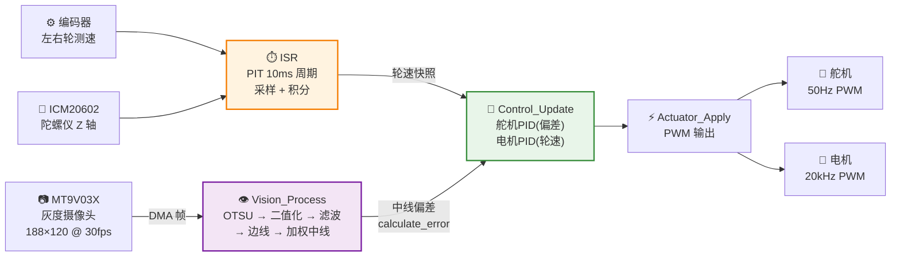

<div align="center">

# 🏎️ GS_Smart_car

**AURIX TC264D 双核智能循迹小车固件**

基于 Infineon AURIX TC264D + 逐飞(SEEKFREE)开源库，裸机裸调度架构


</div>

---

## 📐 系统架构



> **依赖铁律：** 上层 → 下层单向依赖。App → Service → BSP → Vendor。**严禁反向调用。**

---

## 🔄 数据流



---

## 📁 目录结构

```
GS_Smart_car/
├── code/                          # ★ 自研代码（五层架构）
│   ├── app/                       #   应用层 — 主循环编排
│   │   ├── smartcar_app.c/h
│   ├── service/                   #   算法层 — 纯逻辑
│   │   ├── vision/vision.c/h      #     视觉: OTSU/二值化/边线/中线
│   │   └── control/               #     控制
│   │       ├── control.c/h        #       PID决策 + 执行输出
│   │       └── pid.c/h            #       PID通用算法
│   ├── bsp/                       #   驱动层 — 硬件封装
│   │   ├── motor.c/h              #     电机 H桥 PWM
│   │   ├── servo.c/h              #     舵机 50Hz PWM
│   │   ├── display.c/h            #     TFT180 显示
│   │   ├── input.c/h              #     按键/拨码开关
│   │   └── buzzer.c/h             #     蜂鸣器
│   ├── config/                    #   配置层 — 参数集中
│   │   └── config.h               #     所有可调参数 (PID/舵机/电机/阈值)
│   └── common/                    #   公共层 — 共享设施
│       ├── data.c/h               #     全局变量 (z_angle/encoder_speed)
│       ├── init.c/h               #     初始化序列
│       └── utils.c/h              #     工具函数 (my_abs)
│
├── libraries/                     # Vendor 只读 — 逐飞库 + Infineon iLLD
│   ├── infineon_libraries/        #   TC26B iLLD SDK
│   ├── zf_common/                 #   逐飞公共 (时钟/FIFO/字体/头文件)
│   ├── zf_driver/                 #   逐飞驱动 (GPIO/PWM/UART/SPI/ADC/DMA)
│   ├── zf_device/                 #   逐飞设备 (MT9V03X/ICM20602/TFT180/...)
│   └── zf_components/             #   逐飞组件 (无线助手/printf重定向)
│
├── user/                          # SDK 入口模板
│   ├── cpu0_main.c/h              #   CPU0 主函数
│   ├── cpu1_main.c/h              #   CPU1 主函数 (预留双核)
│   ├── isr.c/h                    #   中断服务函数
│   └── isr_config.h               #   中断优先级配置
│
├── tests/                         # 主机端单元测试
│   ├── test_my_abs.c              #   my_abs 测试 (gcc 编译)
│   └── stubs/                     #   桩文件 (脱离嵌入式 SDK 编译)
│
├── ARCHITECTURE.md                # 📖 详细架构文档 (329行)
├── .cproject / .project           # ADS/Eclipse 工程文件
└── Lcf_Tasking_Tricore_Tc.lsl     # TASKING 链接脚本
```

---

## 🚀 快速开始

### 编译

```bash
# 方式一：AURIX Development Studio (推荐)
# 1. 下载安装 ADS v1.10.2+
# 2. File → Open Projects → 选择本目录
# 3. 右键工程 → Build Project

# 方式二：TASKING Eclipse
# 导入工程后直接编译，工具链 VX-toolset for TriCore
```

### 烧录

```bash
# ADS 内置烧录：右键工程 → Flash → Flash Device
# 或使用 DAP MiniWiggler + Infineon MemTool
```

### 主机端测试（无硬件）

```bash
gcc -Itests/stubs -Icode/common tests/test_my_abs.c code/common/utils.c -o test.exe
./test.exe  # 验证 my_abs 正确性
```

---

## ⚙️ 参数配置

所有可调参数集中在 **`code/config/config.h`**，调参只需改一个文件：

```c
/* ===== 舵机 ===== */
#define SERVO_CENTER_DUTY    678     // 舵机中位 PWM
#define SERVO_RANGE          63      // 最大偏转范围

/* ===== 电机 ===== */
#define MOTOR_CLAMP_LEFT     15      // 左轮限幅
#define MOTOR_CLAMP_RIGHT    100     // 右轮限幅

/* ===== PID 增益 ===== */
#define SERVO_PID_KP         3.0f    // 舵机比例
#define SERVO_PID_KD         1.2f    // 舵机微分
#define MOTOR_PID_KP         0.3f    // 电机比例

/* ===== 视觉 ===== */
#define LOST_LINE_THRESHOLD  10      // 丢线停车阈值
```

> 💡 **调参流程：** 上车 → 改 `config.h` → 编译 → 烧录 → 赛道验证 → 迭代

---

## 🧩 模块一览

| 层级 | 模块 | 文件 | 输入 | 输出 |
|:---:|:---:|:---|:---|:---|
| App | 主循环 | `app/smartcar_app.c` | 摄像头帧标志 | 编排 V→C→A 流水线 |
| Service | 视觉 | `service/vision/vision.c` | 灰度图像 | 中线偏差 `calculate_error` |
| Service | 控制 | `service/control/control.c` | 偏差 + 轮速 | PID 输出 → PWM |
| Service | PID | `service/control/pid.c` | 目标值 + 反馈 | PID 计算结果 |
| BSP | 电机 | `bsp/motor.c` | 速度指令 | H 桥 PWM |
| BSP | 舵机 | `bsp/servo.c` | PWM 占空比 | 50Hz 舵机信号 |
| BSP | 显示 | `bsp/display.c` | 边线/中线数据 | TFT180 画面 |
| Common | 数据 | `common/data.c` | — | 全局共享变量 |
| Common | 初始化 | `common/init.c` | — | 全外设就绪 |

---

## 🎬 实车演示

> 📌 **以下位置可添加实车运行动图**

| 循迹演示 | 赛道俯视 | 调试界面 |
|:---:|:---:|:---:|
|  |  |  |
| 直道加速 + 弯道循迹 | 完整赛道俯视 | TFT180 实时调试画面 |

---

## 🔧 开发指南

<details>
<summary><b>📖 如何添加新功能（以超声波避障为例）</b></summary>

```
1. code/bsp/ultrasonic.c/h      ← 驱动层: HC-SR04 触发 + 回波计时
2. code/config/config.h          ← 加 ULTRASONIC_THRESHOLD 参数
3. code/app/smartcar_app.c       ← RunOnce 中加 Obstacle_Check()
4. .cproject                     ← 加 code/bsp include path (如需)
```

**规则：** 新功能按层级放置。驱动放 `bsp/`，算法放 `service/`，参数放 `config.h`。

</details>

<details>
<summary><b>📖 提交规范</b></summary>

```
type(scope): 中文描述

type: feat | fix | refactor | docs | chore | test
scope: app | vision | control | bsp | config | common | isr | core
```

- 不提交 `Debug/`、`.o`、`.elf`、`.hex` 等构建产物
- `libraries/` 改动与应用改动分开提交
- 注释用简单中文，技术术语保留英文（PID/PWM/OTSU/DMA）

</details>

---

## 🗺️ 演进路线

- [x] ~~五层目录重构 + 死代码清理~~
- [x] ~~模块分离（Vision/Control/Actuator）~~
- [x] ~~参数集中化（config.h）~~
- [x] ~~GBK → UTF-8 编码迁移~~
- [x] ~~全量中文注释 + 架构文档~~
- [ ] ADS 编译验证（需硬件环境）
- [ ] ISR 算法迁移到主循环（时序优化）
- [ ] CPU1 视觉处理 offload（双核并行）
- [ ] 万能头文件瘦身（消除传递依赖）

---

## 📄 许可证

本项目底层库遵循 **GPL-3.0** 开源协议（逐飞 TC264 开源库）。

自研代码（`code/` 目录）可自由使用和修改，但需保留逐飞库的版权声明。

<div align="center">

**Made with ⚡ by Paracosm**

详细架构文档见 [`ARCHITECTURE.md`](ARCHITECTURE.md)

</div>
