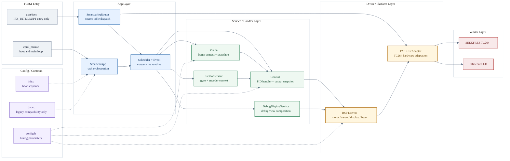
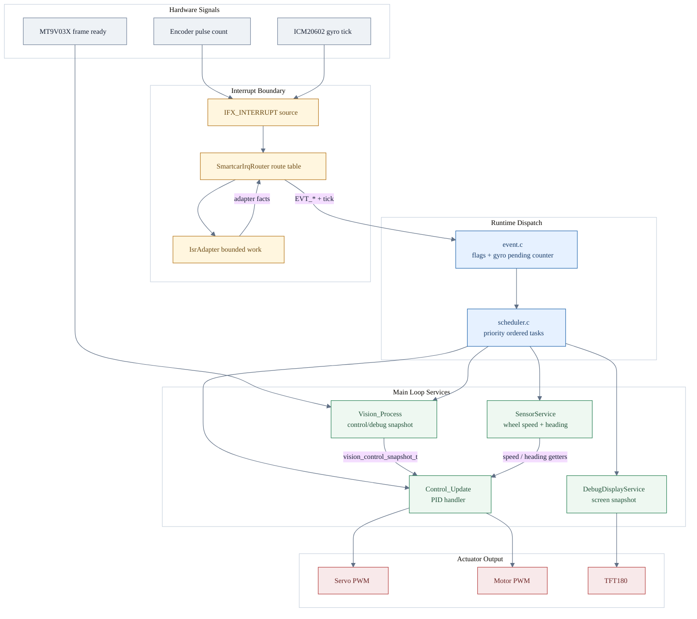
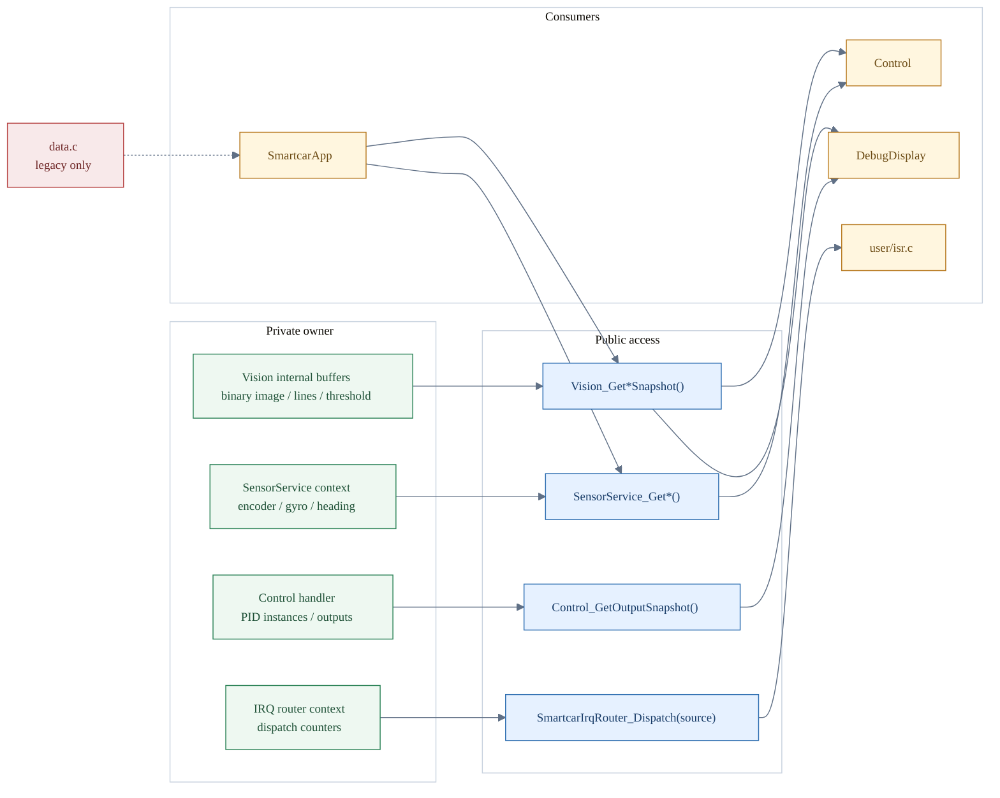

<div align="center">

# 🏎️ GS_Smart_car

**AURIX TC264D 智能循迹小车 · 嵌入式控制工程合集**

摄像头循迹 · 编码器测速 · 陀螺仪积分 · PID 闭环控制


</div>

---

## 📌 项目简介

本仓库是一台基于 **Infineon AURIX TC264D 双核 MCU** 的智能循迹小车完整工程，采用**五层架构**设计，底层依赖逐飞科技（SEEKFREE）TC264 开源库。

> 🔗 **固件代码位于 [`tc264-four-wheel-servo-camera-car`](https://github.com/ParacosmYy/GS_Smart_car/tree/tc264-four-wheel-servo-camera-car) 分支**，本分支（`main`）为项目展示入口。
>
> `master` 分支已退役并从远端删除；后续固件维护、代码审查、实车调试统一进入项目专属分支。

### 核心能力

| 能力 | 传感器 | 算法 |
|:---:|:---|:---|
| 📷 视觉循迹 | MT9V03X 灰度摄像头 (188×120 @ 30fps) | OTSU 自适应二值化 → 滤波 → 边线检测 → 加权中线 |
| ⚙️ 速度闭环 | 左右轮方向编码器 | 增量式 PID (10ms 采样周期) |
| 🧭 航向估计 | ICM20602 六轴陀螺仪 | 零漂补偿 + Z 轴角速度积分 |
| 🎯 转向控制 | 舵机 (50Hz PWM) | 位置式 PID (偏差驱动) |
| ⚡ 驱动输出 | H 桥电机驱动 (20kHz PWM) | 双轮差速控制 |

---

## 📐 系统架构



> **依赖铁律：** `App → Service/Handler → Driver/Platform → Vendor`，单向向下，严禁反向调用。

> **中断边界：** `user/isr.c` 只声明中断源；`SmartcarIrqRouter` 用静态表统一分发；`IsrAdapter` 清硬件标志并产出平台事件；调度事件统一进入 `Scheduler + Event`。

> **状态边界：** 新状态优先进入明确 owner 的 `context/handler`，对外只暴露 snapshot/getter/control API；`data.c` 仅保留历史兼容变量。

---

## 🔄 数据流水线



每帧执行流程：`Vision_Process()` 产出视觉快照，`SensorService_*()` 更新传感器 context，`Control_Update()` 读取快照并更新 PID handler，`Actuator_Apply()` 下发执行器输出。

---

## 🧭 状态 Owner



这张图的判断标准很直接：谁拥有状态，谁负责生命周期；其他模块只能通过 API 或 snapshot 读取，不跨文件直接摸变量。

---

## 📁 工程结构

> 完整代码见 [`tc264-four-wheel-servo-camera-car`](https://github.com/ParacosmYy/GS_Smart_car/tree/tc264-four-wheel-servo-camera-car) 分支

```
GS_Smart_car/                       (tc264-four-wheel-servo-camera-car 分支)
├── code/                           ★ 自研代码 — 五层架构
│   ├── app/                        │  应用层：主循环编排 + IRQ source 路由
│   ├── service/                    │  服务/Handler：视觉 + 传感器 + 控制 + PID
│   │   ├── vision/                 │    ├ OTSU 二值化 / 边线检测 / 加权中线
│   │   ├── sensor/                 │    ├ 编码器快照 / 陀螺仪积分
│   │   ├── diagnostics/            │    ├ TFT 调试显示编排
│   │   └── control/                │    └ PID 决策 / 舵机电机输出
│   ├── bsp/                        │  Driver：电机 / 舵机 / 显示 / 输入 / 蜂鸣器
│   ├── platform/                   │  PAL + TC264 ISR adapter
│   ├── scheduler/                  │  裸机事件调度器
│   ├── config/                     │  配置层：所有可调参数 (config.h)
│   └── common/                     │  公共层：全局变量 / 初始化 / 工具函数
│
├── libraries/                      逐飞库 + Infineon iLLD (只读)
├── user/                           SDK 入口：CPU0/CPU1 main + ISR
├── tests/                          主机端单元测试 (gcc 编译)
└── .cproject                       AURIX Development Studio 工程文件
```

---

## 🧱 Driver + Handler 演进方向

当前固件已经完成中断边界、调度器、SensorService、DebugDisplayService，以及第一阶段 Driver + Handler + Context 收敛。后续重点不是继续堆文件夹，而是把状态所有权持续压清楚：

| 层级 | 职责 | 推荐形态 |
|:---:|:---|:---|
| Driver | 直接控制硬件，不保存业务状态 | `motor_driver_t` + `MotorDriver_SetDuty()` |
| Handler | 持有设备状态、采样窗口、状态机 | `control_handler_t` / `sensor_service_context_t` |
| Service | 编排多个 Handler，输出业务结果 | `Vision_GetControlSnapshot()` |
| App | 只描述调度与业务流程 | `SmartcarApp_RunOnce()` |

推荐迁移原则：

- `static` 变量不禁止，但必须有明确 owner，优先放入 `xxx_context_t`。
- 公共头文件不暴露可写全局状态，改为 `GetSnapshot()` / `GetStatus()` / `Control()`。
- Driver 不反向调用 Handler / Service。
- Handler 可以依赖 Driver，但只通过接口访问硬件。
- Service 不直接碰 Vendor，也不直接碰 TC264 宏。

---

## ⚙️ 参数配置

所有可调参数集中在 **`code/config/config.h`**，调参只需改一个文件：

| 参数组 | 宏定义 | 说明 |
|:---:|:---|:---|
| 舵机 | `SERVO_CENTER_DUTY` / `SERVO_RANGE` | 中位 PWM / 最大偏转范围 |
| 电机 | `MOTOR_CLAMP_LEFT` / `MOTOR_CLAMP_RIGHT` | 左右轮速度限幅 |
| PID | `SERVO_PID_KP` / `SERVO_PID_KD` | 舵机比例/微分增益 |
| PID | `MOTOR_PID_KP` | 电机比例增益 |
| 视觉 | `LOST_LINE_THRESHOLD` | 丢线停车阈值 |
| 定时 | `PIT_PERIOD_MS` | PIT 中断周期 (ms) |

---

## 🚀 快速开始

<details>
<summary><b>📋 编译 & 烧录</b></summary>

```bash
# 1. 克隆工程（项目专属固件分支包含完整代码）
git clone -b tc264-four-wheel-servo-camera-car https://github.com/ParacosmYy/GS_Smart_car.git

# 2. 用 AURIX Development Studio 打开工程目录
#    File → Open Projects → 选择根目录 → Build

# 3. 烧录
#    右键工程 → Flash → Flash Device (DAP MiniWiggler)
```

</details>

<details>
<summary><b>🧪 主机端测试（无硬件）</b></summary>

```bash
gcc -Itests/stubs -Icode/common tests/test_my_abs.c code/common/utils.c -o test.exe
./test.exe
```

</details>

---

## 🧩 模块职责矩阵

| 模块 | 位置 | 输入 | 输出 | 可独立测试 |
|:---:|:---|:---|:---|:---:|
| **视觉** | `service/vision/` | 灰度图像 | 中线偏差 `calculate_error` | ✅ |
| **传感器** | `service/sensor/` | 编码器窗口 + 陀螺仪 tick | 轮速 / 航向角 | ✅ |
| **控制** | `service/control/` | 视觉快照 + 轮速 | PID 输出 → PWM | ✅ |
| **中断路由** | `app/smartcar_irq_router.c` | ISR source | `EVT_*` + 调度 tick | ✅ |
| **电机** | `bsp/motor.c` | 速度指令 | H 桥 PWM | ❌ 需硬件 |
| **舵机** | `bsp/servo.c` | PWM 占空比 | 50Hz 舵机信号 | ❌ 需硬件 |
| **显示** | `bsp/display.c` | 边线/中线数据 | TFT180 画面 | ❌ 需硬件 |
| **配置** | `config/config.h` | — | 所有可调参数 | ✅ 纯宏 |

---

## 🎬 实车演示

> 📌 **以下位置可添加实车运行动图**

| 直道循迹 | 弯道过渡 | TFT 调试画面 |
|:---:|:---:|:---:|
|  |  |  |

---

## 🔧 开发指南

<details>
<summary><b>➕ 如何添加新功能（以超声波避障为例）</b></summary>

```
1. code/bsp/ultrasonic.c/h      ← 驱动层：HC-SR04 触发 + 回波计时
2. code/config/config.h          ← 加 ULTRASONIC_THRESHOLD 参数
3. code/app/smartcar_app.c       ← RunOnce() 中插入 Obstacle_Check()
4. .cproject                     ← 如需，加 include path
```

**原则：** 驱动放 `bsp/`，算法放 `service/`，参数放 `config.h`。依赖单向向下。

</details>

<details>
<summary><b>📝 提交规范</b></summary>

```
type(scope): 中文描述

type:  feat | fix | refactor | docs | chore | test
scope: app | vision | control | bsp | config | common | isr | core
```

- ❌ 不提交 `Debug/`、`.o`、`.elf`、`.hex` 等构建产物
- 📦 `libraries/` 改动与应用改动分开提交
- 💬 注释用简单中文，技术术语保留英文（PID / PWM / OTSU / DMA）

</details>

---

## 🗺️ 项目里程碑

- [x] 仓库卫生（.gitignore + 构建产物清理）
- [x] 五层架构重构（App / Service / BSP / Config / Common）
- [x] 项目专属固件分支维护（tc264-four-wheel-servo-camera-car）
- [x] 死代码清理（-334 行，20+ 符号移除）
- [x] 模块物理分离（vision / control 独立目录）
- [x] 参数集中化（config.h 统一管理）
- [x] GBK → UTF-8 编码迁移
- [x] 注释规范化 + README 架构说明
- [x] 企业级 README
- [ ] ADS 编译验证
- [x] ISR 算法迁移到主循环
- [x] Driver + Handler + Context 第一阶段对象化重构
- [x] SmartcarIrqRouter 表驱动中断源路由
- [ ] CPU1 视觉处理 offload（双核并行）

---

## 📚 相关文档

| 文档 | 位置 | 说明 |
|:---|:---|:---|
| 📋 固件 README | [`tc264-four-wheel-servo-camera-car/README.md`](https://github.com/ParacosmYy/GS_Smart_car/blob/tc264-four-wheel-servo-camera-car/README.md) | 固件工程详细说明 |
| 🧱 架构方向 | 本 README 的 Driver + Handler 演进方向 | Context/Handle 封装、状态所有权、单向依赖 |

---

<div align="center">

**Made with ⚡ by Paracosm**

MIT License · 基于 [SEEKFREE TC264](https://seekfree.taobao.com/) 开源库 (GPL-3.0)

</div>
