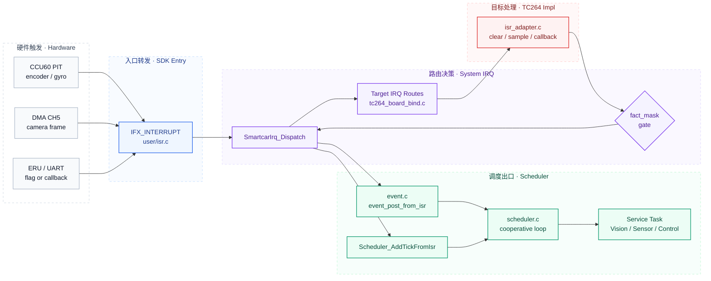

# GS_Smart_car

**AURIX TC264D 智能车固件**

基于 Infineon AURIX TC264D、逐飞 SEEKFREE SDK 与 iLLD。当前架构采用事件驱动协作调度、链接期端口替换和静态 IRQ route 表；业务层不依赖 TC264 Vendor 头，也不经过运行期 dispatch/ops 回环。


## Architecture

```mermaid
flowchart LR
    subgraph L0["入口层 · SDK Entry"]
        direction TB
        ENTRY["cpu0_main.c<br/>user/isr.c"]
    end

    subgraph L1["系统层 · System"]
        direction TB
        RUNTIME["smartcar_system.c<br/>boot composition"]
        IRQ["smartcar_irq_router.c<br/>route consumer"]
        BOARD["smartcar_board.c<br/>smartcar_contract.c"]
    end

    subgraph L2["应用层 · App"]
        direction TB
        APP["smartcar_app.c<br/>task table only"]
    end

    subgraph L3["服务层 · Service"]
        direction TB
        TASKS["smartcar_tasks.c<br/>task facade"]
        SERVICE["vision / sensor / control<br/>diagnostics"]
    end

    subgraph L3B["设备层 · BSP"]
        direction TB
        BSP["motor / servo / display<br/>input / buzzer"]
    end

    subgraph L4["平台契约 · Platform"]
        direction TB
        PORT["mcu_io_if.h<br/>device_if.h<br/>service_port_if.h"]
    end

    subgraph L5["目标适配 · Impl"]
        direction TB
        TC264["TC264 link-time ports<br/>mcu_io_ops / device_ops"]
    end

    subgraph L6["厂家底座 · Vendor"]
        direction TB
        SDK["SEEKFREE SDK<br/>Infineon iLLD"]
    end

    ENTRY --> RUNTIME --> APP --> TASKS --> SERVICE --> PORT
    ENTRY --> IRQ
    RUNTIME --> BOARD --> BSP --> PORT
    PORT -. "link-time symbols" .-> TC264 --> SDK
    IRQ -. "IRQ routes" .-> TC264

    class ENTRY entry
    class RUNTIME,IRQ,BOARD system
    class APP app
    class TASKS,SERVICE service
    class BSP bsp
    class PORT platform
    class TC264 impl
    class SDK vendor

    classDef entry fill:#f8fafc,stroke:#94a3b8,color:#0f172a,stroke-width:1px;
    classDef system fill:#eff6ff,stroke:#2563eb,color:#1e3a8a,stroke-width:1.4px;
    classDef app fill:#ecfdf5,stroke:#059669,color:#064e3b,stroke-width:1.4px;
    classDef service fill:#fff7ed,stroke:#ea580c,color:#7c2d12,stroke-width:1.4px;
    classDef bsp fill:#f0fdfa,stroke:#0d9488,color:#134e4a,stroke-width:1.4px;
    classDef platform fill:#f5f3ff,stroke:#7c3aed,color:#4c1d95,stroke-width:1.4px;
    classDef impl fill:#fef2f2,stroke:#dc2626,color:#7f1d1d,stroke-width:1.4px;
    classDef vendor fill:#f9fafb,stroke:#6b7280,color:#111827,stroke-width:1px;

    style L0 fill:#ffffff,stroke:#cbd5e1,stroke-dasharray:5 5,color:#334155;
    style L1 fill:#f8fbff,stroke:#bfdbfe,stroke-dasharray:5 5,color:#1e3a8a;
    style L2 fill:#f7fefb,stroke:#bbf7d0,stroke-dasharray:5 5,color:#064e3b;
    style L3 fill:#fffaf5,stroke:#fed7aa,stroke-dasharray:5 5,color:#7c2d12;
    style L3B fill:#f7fffd,stroke:#99f6e4,stroke-dasharray:5 5,color:#134e4a;
    style L4 fill:#faf8ff,stroke:#ddd6fe,stroke-dasharray:5 5,color:#4c1d95;
    style L5 fill:#fff8f8,stroke:#fecaca,stroke-dasharray:5 5,color:#7f1d1d;
    style L6 fill:#ffffff,stroke:#d1d5db,stroke-dasharray:5 5,color:#374151;
```



核心边界：

| Layer | Responsibility |
|:--|:--|
| App | 只注册调度任务，不编排视觉、控制、反馈细节 |
| Service | 持有业务状态与算法流水线 |
| BSP | 板级动作封装，只面向平台接口 |
| Platform Interface | `McuIo_*`、`Device_*`、`service_port_if.h` 契约 |
| Impl/TC264 | 直接实现链接期端口符号，调用 SEEKFREE/iLLD |
| Vendor | 第三方 SDK，默认只读 |

## IRQ Flow



保留的调度事件：

| Source | Event |
|:--|:--|
| CCU60 PIT CH0 | `EVT_ENCODER_50MS` |
| CCU60 PIT CH1 | `EVT_GYRO_10MS` + scheduler tick |
| DMA CH5 | `EVT_CAM_FRAME` |
| ERU / UART | 只做清标志或 Vendor 回调 |

## Repository Map

```text
code/
  app/                    task table and main-loop handoff
  service/                task facade plus vision/sensor/control/diagnostics
  bsp/                    motor, servo, display, input, buzzer
  platform/interface/     mcu_io_if, device_if, service_port_if
  platform/system/        system_port, encoder_sample, irq_fact
  platform/target/        target IRQ route contract
  impl/tc264/             TC264 link-time ports, board map, IRQ adapter
  system/board/           board init and product contract binding
  system/irq/             source -> fact/event/tick router
  system/runtime/         boot composition root
  scheduler/              event flags and cooperative scheduler
  config/                 product parameters
user/                     TC264 SDK entry layer
libraries/                SEEKFREE and Infineon vendor code
scripts/                  host smoke guard
tests/smoke/              minimal pure-logic smoke test
```

## Build And Verify

Firmware build:

```text
AURIX Development Studio -> Open Projects -> Build Project
```

Minimal host guard:

```powershell
powershell -ExecutionPolicy Bypass -File scripts/check_syntax.ps1
```

The smoke guard covers event flags, scheduler dispatch, IRQ routing, vision logic, and app/service task syntax. `tests/`, `scripts/`, `docs/`, and `build/` are excluded from ADS target source paths.

## Porting Rules

To add another MCU target:

1. Add `code/impl/<target>/` with direct `McuIo_*` and `Device_*` implementations.
2. Add a target board map and IRQ adapter.
3. Provide `TargetPlatform_GetIrqRoutes()` for that target.
4. Keep App, Service, BSP public headers free of Vendor, board-resource, and `impl/*` includes.
5. Do not reintroduce runtime ops registration, platform dispatch files, old PAL aliases, or duplicate IRQ fact headers.

## Commit Format

```text
type(scope): 中文描述
```

Common scopes: `app`, `service`, `bsp`, `platform`, `impl`, `system`, `scheduler`, `build`, `docs`.

## License

Vendor SDK follows the original SEEKFREE and Infineon licenses under `libraries/`. Project code under `code/` should preserve existing copyright and license notices.
