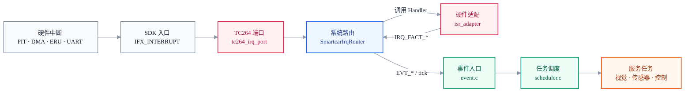

<div align="center">

# GS_Smart_car

**AURIX TC264D 四轮舵机镜头车固件**

基于 Infineon AURIX TC264D + 逐飞 SEEKFREE SDK，采用事件驱动协作式调度与单向依赖分层架构。


</div>

---

## 系统架构

```mermaid
%%{init: {'theme':'base','themeVariables': {'fontFamily':'Segoe UI,Arial,sans-serif','fontSize':'13px','primaryColor':'#ffffff','primaryTextColor':'#172033','lineColor':'#8792a2','clusterBkg':'#f8fafc','clusterBorder':'#d8dee9'}}}%%
flowchart LR
    classDef entry fill:#f8fafc,stroke:#64748b,stroke-width:1.2px,color:#0f172a
    classDef system fill:#eef6ff,stroke:#2563eb,stroke-width:1.6px,color:#1e3a8a
    classDef app fill:#ecfdf5,stroke:#059669,stroke-width:1.6px,color:#065f46
    classDef service fill:#fff7ed,stroke:#ea580c,stroke-width:1.6px,color:#9a3412
    classDef interface fill:#f5f3ff,stroke:#7c3aed,stroke-width:1.6px,color:#4c1d95
    classDef dispatch fill:#ede9fe,stroke:#7c3aed,stroke-width:1.6px,color:#4c1d95
    classDef board fill:#eef6ff,stroke:#2563eb,stroke-width:1.6px,color:#1e3a8a
    classDef impl fill:#fff1f2,stroke:#e11d48,stroke-width:1.6px,color:#9f1239
    classDef vendor fill:#f1f5f9,stroke:#475569,stroke-width:1.2px,color:#334155

    ENTRY["cpu0_main / user/isr"]:::entry
    RUNTIME["System Runtime<br/>smartcar_system"]:::system
    IRQ["IRQ Router + Port Adapter"]:::system
    APP["App Task Table<br/>SmartcarApp"]:::app
    SVC["Service<br/>vision · sensor · control · diagnostics"]:::service
    BSP["BSP<br/>motor · servo · display · input · buzzer"]:::service
    IFACE["Platform Interface<br/>mcu_io_if · device_if · actuator_if"]:::interface
    DISPATCH["Platform Dispatch<br/>mcu_io_dispatch · device_dispatch"]:::dispatch
    BOARD["Board Composition<br/>smartcar_board · resources"]:::board
    TARGET["Target Bind<br/>tc264_board_bind"]:::impl
    TCROP["Target Ops<br/>tc264_mcu_io_ops · device_ops"]:::impl
    IRQIMPL["Target IRQ<br/>irq_port · isr_adapter"]:::impl
    VENDOR["Vendor SDK<br/>SEEKFREE · Infineon iLLD"]:::vendor

    ENTRY --> RUNTIME
    ENTRY --> IRQ
    RUNTIME --> APP
    RUNTIME --> BOARD
    APP --> SVC
    SVC --> IFACE
    BSP --> IFACE
    IFACE --> DISPATCH
    DISPATCH --> BOARD
    BOARD --> TARGET
    TARGET --> TCROP
    TARGET --> IRQIMPL
    IRQIMPL --> VENDOR
    TCROP --> VENDOR
    IRQ --> IRQIMPL
```

本项目采用单向依赖的 MCU 固件分层与 ops 注册架构。上层聚焦车辆任务、传感器算法和控制策略，下层通过 `McuIo_*` / `Device_*` / `Actuator_*` 接口契约和 Board_BindOps 注入实现。换 MCU 时只新增 `code/impl/<target>` 的 ops 实现和 board bind，不改上层代码。



| 层级 | 稳定职责 | 变化入口 |
|:---|:---|:---|
| App | 任务编排、主循环入口、业务触发顺序 | 功能流程变化 |
| Service / Handler | 视觉、传感器、控制、诊断状态 owner | 算法策略变化 |
| BSP / Driver | 板级设备动作封装（通过 McuIo_* / Device_* 访问硬件） | 设备组合变化 |
| Platform Interface | ops 契约头文件（mcu_io_if.h, device_if.h, actuator_if.h 等） | 能力抽象变化 |
| Platform Dispatch | ops 注册 + 调度转发（mcu_io_dispatch.c, device_dispatch.c） | 稳定 |
| Board Composition | ops 注册表装配 + 设备初始化顺序 | 板级资源 / 产品变化 |
| Target Bind | ops 表填充 + TargetPlatform_RegisterAll() | MCU 变化 |
| Impl TC264 | TC264 ops 实现 + 板级映射 + IRQ port + ISR adapter | MCU / SDK 变化 |
| Vendor | SEEKFREE 与 Infineon iLLD | SDK 版本变化 |

**依赖规则：** App、Service、BSP 不包含 `zf_common_headfile.h`、`Ifx*` 或 Vendor 类型。生产代码必须使用 `McuIo_*` / `Device_*` / `Actuator_*` API，不直接调用 `pal_*` 或 Vendor 函数。

**Interface 头文件（平台无关，BSP/Service 依赖）：**
- `platform/interface/mcu_io_if.h` — `McuIo_GpioInit()`, `McuIo_PwmSetDuty()`, `McuIo_UartInit()`, `McuIo_EncoderGet()`, `McuIo_PitInit()`
- `platform/interface/device_if.h` — `Device_CameraInit()`, `Device_DisplayPoint()`, `Device_ImuRead()`, `Device_WirelessInit()`, `Device_KeyInit()`
- `platform/interface/actuator_if.h` — `Actuator_SetServo()`, `Actuator_SetMotorLeft()`, `Actuator_SetMotorRight()`
- `platform/interface/feedback_if.h` — `Feedback_NotifyElement()`, `Feedback_Tick()`
- `platform/interface/track_display_if.h` — `TrackDisplay_DrawLines()`

**资源编号（板级产品配置）：** `system/board/smartcar_board_resources.h` — `SMARTCAR_PWM_SERVO`, `SMARTCAR_GPIO_BUZZER`, `SMARTCAR_ENCODER_LEFT`

## 中断与调度

中断入口保持薄封装，目标芯片细节收口在 `code/impl/tc264`。`user/isr.c` 只承接 `IFX_INTERRUPT`，`tc264_irq_port.c` 维护目标 source 与 adapter 的绑定，`SmartcarIrqRouter` 统一把中断事实转换为调度事件。



关键约束：

- `SmartcarIrqRouter` 位于 `code/system/irq/smartcar_irq_router.c/h`，负责通用 source 查表、fact 校验、事件映射和 tick 发布。
- `Tc264IrqPort` 位于 `code/impl/tc264/tc264_irq_port.c/h`，集中维护 TC264 source、SDK ISR entry port 与 adapter handler 的绑定。
- `IsrAdapter` 位于 `code/impl/tc264/isr_adapter.c/h`，只做清标志、有界整数采样、Vendor ISR callback，返回 `IRQ_FACT_*`。
- DMA 摄像头帧完成由 adapter 返回 `IRQ_FACT_CAMERA_FRAME`，router 统一发布 `EVT_CAM_FRAME`；App 不再轮询后伪造 ISR 事件。
- `EVT_GYRO_10MS` 使用计数语义，避免主循环阻塞时吞掉 10ms tick。

## 目录结构

```text
GS_Smart_car/
├── code/
│   ├── app/                       # 应用层：只做生命周期、任务注册、主循环编排
│   │   └── smartcar_app.c/h
│   ├── service/                   # 服务/算法层：vision、sensor、control、diagnostics
│   ├── bsp/                       # BSP/Driver：motor、servo、display、input、buzzer
│   ├── platform/                  # ops 接口、dispatch、中性 system port；platform.h 仅兼容聚合
│   ├── impl/tc264/                # TC264 Impl：board bind/map、device/mcu ops、isr_adapter、tc264_irq_port
│   ├── system/board/              # 本车板级启动序列：设备初始化、周期中断启动
│   ├── system/runtime/            # 系统启动编排：SDK entry 与 App 解耦
│   ├── system/irq/                # 系统中断路由：source/fact/event/tick
│   ├── scheduler/                 # event + cooperative scheduler
│   ├── config/                    # config.h 集中参数
│   └── common/                    # utils/legacy data；init.h 仅作 SEEKFREE 兼容头
├── user/                          # TC264 SDK entry：cpu0/cpu1/isr/isr_config
├── libraries/                     # Vendor SDK：Infineon iLLD + SEEKFREE，默认只读
├── tests/                         # 主机端测试与 stubs
├── .cproject / .project           # ADS/Eclipse 工程配置
└── Lcf_Tasking_Tricore_Tc.lsl     # TASKING 链接脚本
```

## 快速开始

### ADS 编译

```bash
# AURIX Development Studio
# File -> Open Projects -> 选择本目录 -> Build Project
```

### 主机端测试

```powershell
powershell -ExecutionPolicy Bypass -File scripts/run_host_tests.ps1
```

脚本会统一编译并运行 `test_my_abs`、`test_event`、`test_scheduler`、`test_irq_router`、`test_board_map`、`test_vision_algo`，所有主机端测试产物输出到 `build/host-tests/`。脚本内的 GCC include path 固定包含 `-Icode`，并按测试显式列出源文件，避免重复链接 `event.c`。

### 主机端语法检查

```bash
gcc -std=c99 -Werror=implicit-function-declaration -fsyntax-only \
  -Icode -Icode/app -Icode/platform -Icode/config -Icode/common -Icode/bsp \
  -Icode/service/control -Icode/service/vision -Icode/service/sensor \
  -Icode/service/diagnostics -Icode/scheduler -Icode/system/irq -Icode/system/board \
  -Icode/system/runtime -Icode/impl/tc264 \
  code/app/smartcar_app.c code/system/runtime/smartcar_system.c \
  code/system/board/smartcar_board.c code/system/irq/smartcar_irq_router.c \
  code/impl/tc264/tc264_irq_port.c \
  code/service/control/control.c code/service/control/pid.c code/service/vision/vision.c \
  code/service/sensor/sensor.c code/service/diagnostics/debug_display.c \
  code/service/diagnostics/feedback_service.c \
  code/scheduler/event.c code/scheduler/scheduler.c code/common/data.c code/common/utils.c \
  code/bsp/motor.c code/bsp/servo.c code/bsp/input.c code/bsp/buzzer.c code/bsp/display.c
```

`code/impl/tc264/*` 和 `user/isr.c` 依赖 TC264/逐飞宏，主要通过 ADS 或实车环境验证。当前 `.cproject` 的 Debug 配置已同步新增 include path；Release/External 工程配置如需使用，应按 Debug 配置补齐。

## 模块一览

| 层级 | 模块 | 文件 | 职责 |
|:---:|:---:|:---|:---|
| System | 启动编排 | `code/system/runtime/smartcar_system.c` | clock/debug、board init、scheduler、App、PIT 启动顺序 |
| System | 板级启动 | `code/system/board/smartcar_board.c` | 本车设备初始化与周期中断启动 |
| App | 主循环 | `code/app/smartcar_app.c` | 任务表注册、调度器驱动 |
| System/IRQ | 中断路由 | `code/system/irq/smartcar_irq_router.c` | generic source -> fact -> scheduler event/tick |
| Service | 视觉 | `code/service/vision/vision.c` | 图像处理、边线/中线、控制快照 |
| Service | 传感器 | `code/service/sensor/sensor.c` | 陀螺仪积分、编码器速度 context |
| Service | 控制 | `code/service/control/control.c` | PID handler、执行器指令 |
| BSP | 板级设备 | `code/bsp/*.c` | 电机、舵机、显示、输入、蜂鸣器 |
| Platform Interface | ops 契约 | `code/platform/interface/{mcu_io,device,actuator,feedback,track_display}_if.h` | 平台无关硬件能力接口 |
| TC264 Impl | IRQ Port | `code/impl/tc264/tc264_irq_port.c` | TC264 SDK ISR entry -> system router port |
| TC264 Impl | Target ops/ISR 实现 | `code/impl/tc264/*.c` | ops 转 Vendor SDK、ISR 硬件事实 |
| SDK Entry | TC264 入口 | `user/isr.c` | `IFX_INTERRUPT` 薄入口 |
| Vendor SDK | 原厂库 | `libraries/` | Infineon iLLD + SEEKFREE |

## 开发规则

新增功能先判断 owner：

1. 应用流程放 `code/app`，不能包含硬件宏。
2. 算法和状态放 `code/service/<module>`，用 context/handler 管理运行态。
3. 板级设备能力放 `code/bsp`，只依赖具体 Platform 能力头。
4. 新硬件抽象先扩展或新增 `code/platform/interface/<domain>_if.h` 能力头 + ops_t，再在 `code/impl/tc264` 实现 ops 表，最后由 Board 层注册。
5. 中断源新增时同步 `user/isr.c` 薄入口、`Tc264IrqPort` 端口路由、`IsrAdapter` fact。
6. Vendor SDK 只读；确需修改时单独提交并说明原因。

## MCU 可移植性现状

本轮后，App、Service、BSP 与 TC264 source 枚举解耦，SDK entry 通过 `SmartcarSystem_Boot()` 和 `Tc264IrqPort_Init()` 接入系统。`platform.h` 已降级为兼容聚合头，生产代码改为 include 具体 Platform 能力接口。移植到新 MCU 时，优先新增 `code/impl/<target>/platform_<target>.c`、`<target>_irq_port.c/h` 和 SDK entry，不应修改 App/Service 业务逻辑。

仍需继续收敛的边界：

- `vision.c` 使用 `VISION_RAW_W/H` 自有尺寸宏，后续可改为 frame context/capability 查询。
- `isr_adapter.c` 的 encoder window 状态可进一步 context-ify。
- `isr_adapter.c` 仍是目标平台集中适配文件，下一阶段可按 PIT/DMA/UART 子适配拆分。

提交格式：

```text
type(scope): 中文描述

feat | fix | refactor | docs | chore | test
scope: app | service | bsp | platform | impl | system | scheduler | docs
```

## 演进路线

- [x] App 与 System/IRQ 解耦，`SmartcarIrqRouter` 移出 `code/app`
- [x] Platform API 与 TC264 Impl 解耦，TC264 ops / `isr_adapter.c` 收敛在 `code/impl/tc264`
- [x] 摄像头 DMA 帧事件归入 adapter fact -> system router -> scheduler event 链路
- [x] `Driver + Handler + Context` 第一阶段：Sensor/ISR/Control/Vision 状态 owner 收敛
- [x] README / AGENTS / `.cproject` 同步新架构边界
- [x] `platform.h` 降级为兼容聚合头，业务代码改用 `platform/interface/*_if.h`
- [x] App -> Buzzer 与 Board -> Control 的跨层依赖收敛到 Service/System composition root
- [ ] 拆分 `isr_adapter.c` 为 camera/encoder/uart 子 adapter
- [ ] 为 `event` 增加 per-event policy：flag / counter / saturating counter
- [ ] CPU1 视觉处理 offload
- [ ] ADS + 实车完整验证

## 许可证

底层 Vendor SDK 遵循逐飞 TC264 开源库及 Infineon iLLD 的原许可。自研代码位于 `code/`，请保留原版权声明与第三方库许可文件。
