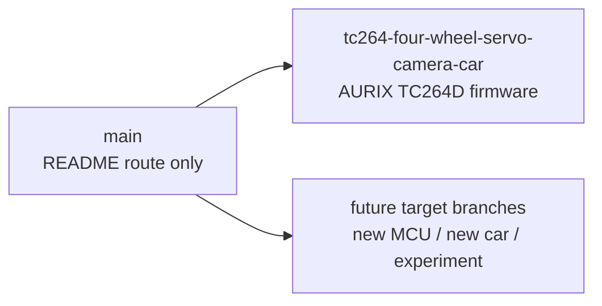

# GS_Smart_car

**智能车固件仓库路由页**

`main` 只承担仓库入口和分支导航职责，不作为任何固件目标的权威说明。

具体工程的架构、构建方式、调试约束、模块说明、移植方案和变更记录，均以对应目标分支的 `README.md` 为准。

## Branch Router



## 分支入口

| 分支 | 定位 | README | 状态 |
|:--|:--|:--|:--|
| `main` | 仓库路由页，只说明应该进入哪个分支 | 当前文件 | 路由入口 |
| `tc264-four-wheel-servo-camera-car` | AURIX TC264D 四轮舵机摄像头智能车固件主线 | [分支 README](https://github.com/ParacosmYy/GS_Smart_car/blob/tc264-four-wheel-servo-camera-car/README.md) | 当前有效工程 |

## 进入工程

如果你要查看、编译、调试或继续开发当前 TC264 智能车固件，直接进入目标分支：

```bash
git clone -b tc264-four-wheel-servo-camera-car https://github.com/ParacosmYy/GS_Smart_car.git
```

已克隆仓库时：

```bash
git fetch origin
git switch tc264-four-wheel-servo-camera-car
```

然后阅读该分支的 `README.md`。那里才是当前固件的根文档。

## main 分支边界

`main` 不维护以下内容：

- 不维护具体 MCU 的架构图；
- 不维护 ADS / IDE 构建步骤；
- 不维护模块职责矩阵；
- 不维护算法、PID、视觉、传感器或 BSP 细节；
- 不维护实车调试记录；
- 不承诺能代表任一目标分支的最新代码状态。

`main` 只维护以下内容：

- 有哪些目标分支；
- 每个分支解决什么问题；
- 应该从哪里进入对应工程；
- 新分支 README 的维护规则。

## 分支 README 规则

每个目标分支的 `README.md` 必须自洽，至少说明：

| 内容 | 说明 |
|:--|:--|
| Target | MCU、板卡、车模形态、主要外设 |
| Architecture | 该分支实际采用的分层、依赖方向和中断边界 |
| Build | 真实可用的 IDE / 工具链 / 构建入口 |
| Porting | 更换 MCU、Vendor SDK、工程配置时应该改哪里 |
| Constraints | 当前已知限制、验证边界、不能误用的 host 检查 |
| Status | 当前分支是否可编译、可烧录、可实车运行 |

当目标分支发生架构、构建、目录或移植边界变化时，只更新该分支 README；`main` 只在新增、删除、重命名分支时更新路由表。

## 分支命名建议

新目标分支使用明确的硬件和车模语义：

```text
<mcu>-<car-or-board>-<main-sensors>
```

示例：

```text
tc264-four-wheel-servo-camera-car
stm32h7-bldc-camera-car
rk3566-linux-vision-car
```

## 维护原则

- `main` 是地图，不是目的地。
- 目标分支 README 是根文档。
- 不把分支实现细节复制到 `main`。
- 不让 `main` 的旧描述覆盖目标分支的最新事实。
- 新增目标分支时，先写好分支 README，再把入口登记到本文件。
