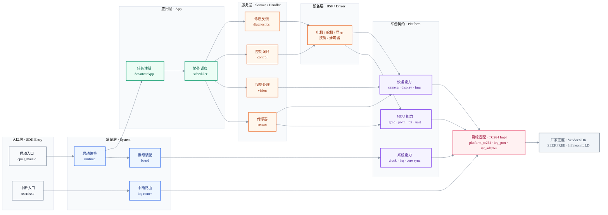
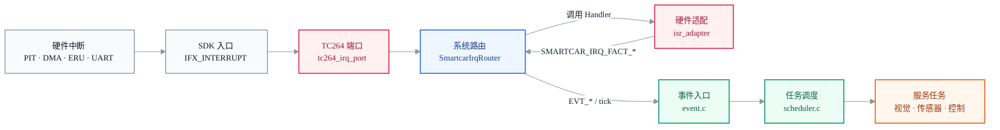

<div align="center">

# GS_Smart_car

**AURIX TC264D 四轮舵机镜头车固件**

基于 Infineon AURIX TC264D + 逐飞 SEEKFREE SDK，采用事件驱动协作式调度与单向依赖分层架构。


</div>

---

## 系统架构

本项目采用单向依赖的 MCU 固件分层。上层聚焦车辆任务、传感器算法和控制策略，下层隔离 TC264、板级资源与 Vendor SDK。后续换 MCU、换摄像头或调整板级资源时，改动应收敛在目标适配层、Platform 契约实现和板级配置中。



| 层级 | 稳定职责 | 变化入口 |
|:---|:---|:---|
| App | 任务编排、主循环入口、业务触发顺序 | 功能流程变化 |
| Service / Handler | 视觉、传感器、控制、诊断状态 owner | 算法策略变化 |
| BSP / Driver | 板级设备动作封装 | 设备组合变化 |
| Platform | 平台无关接口、资源编号、系统能力契约 | 能力抽象变化 |
| Impl | TC264 适配、IRQ port、Vendor wrapper | MCU 或 SDK 变化 |
| Vendor | SEEKFREE 与 Infineon iLLD | SDK 版本变化 |

**依赖规则：** App、Service、BSP 不包含 `zf_common_headfile.h`、`Ifx*` 或 Vendor 类型；新代码不包含 `platform.h` 聚合头，必须包含具体能力头，例如 `platform/mcu/pal_gpio.h`、`platform/device/pal_camera.h`、`platform/system/pal_system.h`。

## 中断与调度

中断入口保持薄封装，目标芯片细节收口在 `code/impl/tc264`。`user/isr.c` 只承接 `IFX_INTERRUPT`，`tc264_irq_port.c` 维护目标 source 与 adapter 的绑定，`SmartcarIrqRouter` 统一把中断事实转换为调度事件。



关键约束：

- `SmartcarIrqRouter` 位于 `code/system/irq/smartcar_irq_router.c/h`，负责通用 source 查表、fact 校验、事件映射和 tick 发布。
- `Tc264IrqPort` 位于 `code/impl/tc264/tc264_irq_port.c/h`，集中维护 TC264 source、SDK ISR entry port 与 adapter handler 的绑定。
- `IsrAdapter` 位于 `code/impl/tc264/isr_adapter.c/h`，只做清标志、有界整数采样、Vendor ISR callback，返回 `SMARTCAR_IRQ_FACT_*`。
- DMA 摄像头帧完成由 adapter 返回 `SMARTCAR_IRQ_FACT_CAMERA_FRAME`，router 统一发布 `EVT_CAM_FRAME`；App 不再轮询后伪造 ISR 事件。
- `EVT_GYRO_10MS` 使用计数语义，避免主循环阻塞时吞掉 10ms tick。

## 目录结构

```text
GS_Smart_car/
├── code/
│   ├── app/                       # 应用层：只做生命周期、任务注册、主循环编排
│   │   └── smartcar_app.c/h
│   ├── service/                   # 服务/算法层：vision、sensor、control、diagnostics
│   ├── bsp/                       # BSP/Driver：motor、servo、display、input、buzzer
│   ├── platform/                  # PAL 契约：common/mcu/device/system；platform.h 仅兼容聚合
│   ├── impl/tc264/                # TC264 Impl：platform_tc264、isr_adapter、tc264_irq_port
│   ├── system/board/              # 本车板级启动序列：设备初始化、周期中断启动
│   ├── system/runtime/            # 系统启动编排：SDK entry 与 App 解耦
│   ├── system/irq/                # 系统中断路由：source/fact/event/tick
│   ├── scheduler/                 # event + cooperative scheduler
│   ├── config/                    # config.h 集中参数
│   └── common/                    # utils/legacy data；init.h 仅作 SEEKFREE 兼容头
├── user/                          # TC264 SDK entry：cpu0/cpu1/isr/isr_config
├── libraries/                     # Vendor SDK：Infineon iLLD + SEEKFREE，默认只读
├── tests/                         # 主机端测试与 stubs
├── .cproject / .project           # ADS/Eclipse 工程配置
└── Lcf_Tasking_Tricore_Tc.lsl     # TASKING 链接脚本
```

## 快速开始

### ADS 编译

```bash
# AURIX Development Studio
# File -> Open Projects -> 选择本目录 -> Build Project
```

### 主机端测试

```bash
gcc -Itests/stubs -Icode/common tests/test_my_abs.c code/common/utils.c -o test_my_abs.exe
./test_my_abs.exe

gcc -Itests/stubs -Icode/platform -Icode/scheduler tests/test_event.c code/scheduler/event.c -o test_event.exe
./test_event.exe

gcc -Itests/stubs -Icode/scheduler tests/test_scheduler.c code/scheduler/scheduler.c -o test_scheduler.exe
./test_scheduler.exe
```

### 主机端语法检查

```bash
gcc -std=c99 -Werror=implicit-function-declaration -fsyntax-only \
  -Icode -Icode/app -Icode/platform -Icode/config -Icode/common -Icode/bsp \
  -Icode/service/control -Icode/service/vision -Icode/service/sensor \
  -Icode/service/diagnostics -Icode/scheduler -Icode/system/irq -Icode/system/board \
  -Icode/system/runtime -Icode/impl/tc264 \
  code/app/smartcar_app.c code/system/runtime/smartcar_system.c \
  code/system/board/smartcar_board.c code/system/irq/smartcar_irq_router.c \
  code/impl/tc264/tc264_irq_port.c \
  code/service/control/control.c code/service/control/pid.c code/service/vision/vision.c \
  code/service/sensor/sensor.c code/service/diagnostics/debug_display.c \
  code/service/diagnostics/feedback_service.c \
  code/scheduler/event.c code/scheduler/scheduler.c code/common/data.c code/common/utils.c \
  code/bsp/motor.c code/bsp/servo.c code/bsp/input.c code/bsp/buzzer.c code/bsp/display.c
```

`code/impl/tc264/platform_tc264.c`、`code/impl/tc264/isr_adapter.c` 和 `user/isr.c` 依赖 TC264/逐飞宏，主要通过 ADS 或实车环境验证。当前 `.cproject` 的 Debug 配置已同步新增 include path；Release/External 工程配置如需使用，应按 Debug 配置补齐。

## 模块一览

| 层级 | 模块 | 文件 | 职责 |
|:---:|:---:|:---|:---|
| System | 启动编排 | `code/system/runtime/smartcar_system.c` | clock/debug、board init、scheduler、App、PIT 启动顺序 |
| System | 板级启动 | `code/system/board/smartcar_board.c` | 本车设备初始化与周期中断启动 |
| App | 主循环 | `code/app/smartcar_app.c` | 任务表注册、调度器驱动 |
| System/IRQ | 中断路由 | `code/system/irq/smartcar_irq_router.c` | generic source -> fact -> scheduler event/tick |
| Service | 视觉 | `code/service/vision/vision.c` | 图像处理、边线/中线、控制快照 |
| Service | 传感器 | `code/service/sensor/sensor.c` | 陀螺仪积分、编码器速度 context |
| Service | 控制 | `code/service/control/control.c` | PID handler、执行器指令 |
| BSP | 板级设备 | `code/bsp/*.c` | 电机、舵机、显示、输入、蜂鸣器 |
| Platform API | PAL | `code/platform/{common,mcu,device,system}/pal_*.h` | 平台无关硬件能力接口 |
| TC264 Impl | IRQ Port | `code/impl/tc264/tc264_irq_port.c` | TC264 SDK ISR entry -> system router port |
| TC264 Impl | PAL/ISR 实现 | `code/impl/tc264/*.c` | PAL 转 Vendor SDK、ISR 硬件事实 |
| SDK Entry | TC264 入口 | `user/isr.c` | `IFX_INTERRUPT` 薄入口 |
| Vendor SDK | 原厂库 | `libraries/` | Infineon iLLD + SEEKFREE |

## 开发规则

新增功能先判断 owner：

1. 应用流程放 `code/app`，不能包含硬件宏。
2. 算法和状态放 `code/service/<module>`，用 context/handler 管理运行态。
3. 板级设备能力放 `code/bsp`，只依赖具体 Platform 能力头。
4. 新硬件抽象先扩展或新增 `code/platform/<domain>/pal_*.h` 能力头，再在 `code/impl/tc264` 实现；不要把新业务代码挂到 `platform.h` 聚合头上。
5. 中断源新增时同步 `user/isr.c` 薄入口、`Tc264IrqPort` 端口路由、`IsrAdapter` fact。
6. Vendor SDK 只读；确需修改时单独提交并说明原因。

## MCU 可移植性现状

本轮后，App、Service、BSP 与 TC264 source 枚举解耦，SDK entry 通过 `SmartcarSystem_Boot()` 和 `Tc264IrqPort_Init()` 接入系统。`platform.h` 已降级为兼容聚合头，生产代码改为 include 具体 Platform 能力接口。移植到新 MCU 时，优先新增 `code/impl/<target>/platform_<target>.c`、`<target>_irq_port.c/h` 和 SDK entry，不应修改 App/Service 业务逻辑。

仍需继续收敛的边界：

- `vision.c` 仍使用 `PAL_CAM_W/H` 静态几何尺寸，后续建议改为 frame context/capability 查询。
- 显示像素级能力已进入 `pal_display.h`，但屏幕能力还可继续抽象为 runtime capability/config。
- `isr_adapter.c` 仍是目标平台集中适配文件，下一阶段可按 PIT/DMA/UART 子适配拆分。

提交格式：

```text
type(scope): 中文描述

feat | fix | refactor | docs | chore | test
scope: app | service | bsp | platform | impl | system | scheduler | docs
```

## 演进路线

- [x] App 与 System/IRQ 解耦，`SmartcarIrqRouter` 移出 `code/app`
- [x] Platform API 与 TC264 Impl 解耦，`platform_tc264.c` / `isr_adapter.c` 移入 `code/impl/tc264`
- [x] 摄像头 DMA 帧事件归入 adapter fact -> system router -> scheduler event 链路
- [x] `Driver + Handler + Context` 第一阶段：Sensor/ISR/Control/Vision 状态 owner 收敛
- [x] README / AGENTS / `.cproject` 同步新架构边界
- [x] `platform.h` 降级为兼容聚合头，业务代码改用具体 `pal_*.h`
- [x] App -> Buzzer 与 Board -> Control 的跨层依赖收敛到 Service/System composition root
- [ ] 拆分 `isr_adapter.c` 为 camera/encoder/uart 子 adapter
- [ ] 为 `event` 增加 per-event policy：flag / counter / saturating counter
- [ ] CPU1 视觉处理 offload
- [ ] ADS + 实车完整验证

## 许可证

底层 Vendor SDK 遵循逐飞 TC264 开源库及 Infineon iLLD 的原许可。自研代码位于 `code/`，请保留原版权声明与第三方库许可文件。
