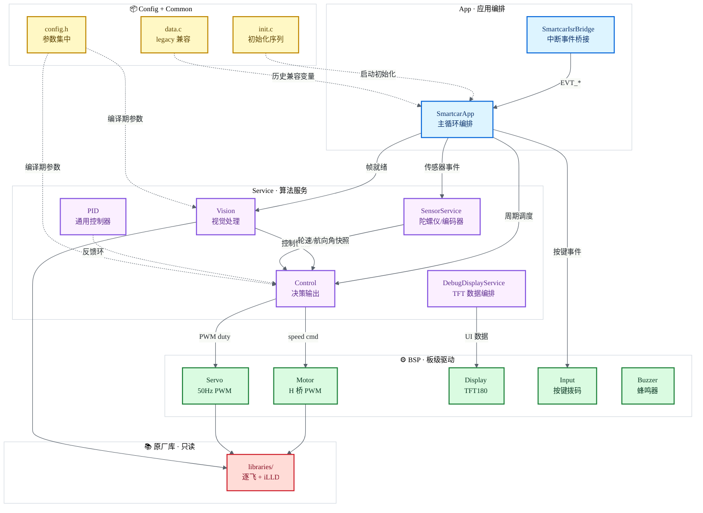
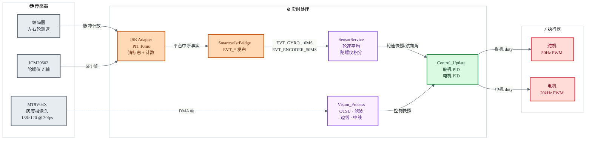
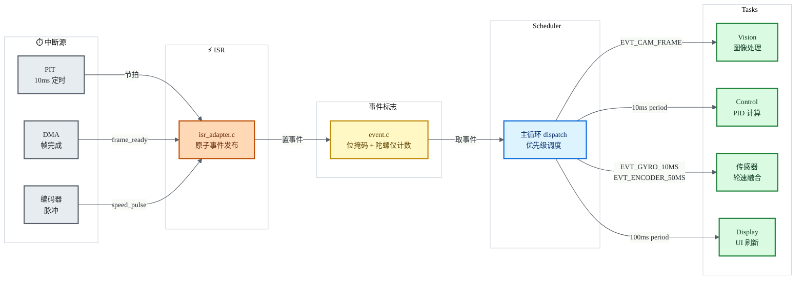

<div align="center">

# 🏎️ GS_Smart_car

**AURIX TC264D 双核智能循迹小车固件**

基于 Infineon AURIX TC264D + 逐飞(SEEKFREE)开源库，事件驱动协作式调度架构


</div>

---

## 📐 系统架构

五层单向依赖：**应用层 → 服务层 → 板级/平台层 → 原厂库**，配置与公共层横向贯穿。当前阶段同步推进 **Driver + Handler + Context**：Driver 只封装硬件/算法原语，Handler 持有模块状态，Context 明确运行态 owner。



> **依赖铁律：** 实线 = 运行时调用，虚线 = 编译期/启动期依赖。上层 → 下层单向，**严禁反向调用**。各模块文件清单见下方[模块一览](#-模块一览)。

> **维护分支：** 当前工程主维护分支为 `tc264-four-wheel-servo-camera-car`，对应 TC264 四轮舵机镜头车固件。

> **中断边界：** `user/isr.c` 只保留 `IFX_INTERRUPT` 入口；`code/platform/isr_adapter.c` 只做清标志与有界整数采样；`code/app/smartcar_isr_bridge.c` 将平台中断事实翻译为 `EVT_*` 调度事件。`EVT_GYRO_10MS` 使用计数语义，避免主循环阻塞时丢失 10ms 节拍。

> **状态边界：** 运行态状态不再优先放入 `data.c`。`SensorService` 拥有陀螺仪/编码器 context，`Control` 拥有 PID handler 与输出快照，`Vision` 通过 control/debug snapshot 向外提供只读结果，`Scheduler` 自己维护系统时间基。

---

## 🔄 数据流

左 → 右单向流水线：中断适配 → 事件调度 → 服务算法 → 板级/平台输出。箭头标注每一跳的物理量或数据结构。



> **采样周期：** PIT 10ms 先进入中断适配层清标志与累加采样，再由 App ISR bridge 发布调度事件；陀螺仪积分和编码器平均在传感器服务中完成。摄像头 DMA 帧异步到达，主循环按帧就绪标志触发视觉服务。

---

## 🚀 调度架构

当前已引入事件驱动 + 优先级调度器，中断适配层只做有界整数工作，App ISR bridge 负责事件发布，算法在主循环按事件类型分发，为后续 CPU1 视觉分担计算保留边界。



> **关键收益：** 中断只做「清标志 + 累加」（微秒级），事件发布集中在 App ISR bridge，算法在主循环按事件类型分发，可按优先级抢占显示任务；陀螺仪节拍使用计数事件，不会被普通位掩码合并吞掉。

---

## 📁 目录结构

```
GS_Smart_car/
├── code/                          # ★ 自研代码（五层架构）
│   ├── app/                       #   应用层 — 主循环编排
│   │   ├── smartcar_app.c/h
│   │   └── smartcar_isr_bridge.c/h #     ISR 事实到调度事件的桥接
│   ├── service/                   #   算法层 — 纯逻辑
│   │   ├── vision/vision.c/h      #     视觉: OTSU/二值化/边线/中线
│   │   ├── sensor/sensor.c/h      #     SensorService: 陀螺仪积分 + 编码器速度快照
│   │   ├── diagnostics/debug_display.c/h #    DebugDisplayService: TFT 调试显示编排
│   │   └── control/               #     控制
│   │       ├── control.c/h        #       PID决策 + 执行输出
│   │       └── pid.c/h            #       PID通用算法
│   ├── bsp/                       #   驱动层 — 硬件封装
│   │   ├── motor.c/h              #     电机 H桥 PWM
│   │   ├── servo.c/h              #     舵机 50Hz PWM
│   │   ├── display.c/h            #     TFT180 显示
│   │   ├── input.c/h              #     按键/拨码开关
│   │   └── buzzer.c/h             #     蜂鸣器
│   ├── config/                    #   配置层 — 参数集中
│   │   └── config.h               #     所有可调参数 (PID/舵机/电机/阈值)
│   ├── platform/                  #   平台抽象 — PAL + TC264 适配
│   │   ├── platform.h             #     平台无关接口
│   │   ├── platform_tc264.c       #     逐飞/TC264 原厂库适配
│   │   └── isr_adapter.c/h        #     ISR 硬件清标志与平台中断事实输出
│   ├── scheduler/                 #   裸机事件调度
│   │   ├── event.c/h              #     位掩码 + 陀螺仪待处理计数
│   │   └── scheduler.c/h          #     协作式任务调度器
│   └── common/                    #   公共层 — 共享设施
│       ├── data.c/h               #     legacy 兼容变量，新状态优先进入 context/handler
│       ├── init.c/h               #     初始化序列
│       └── utils.c/h              #     工具函数 (my_abs)
│
├── libraries/                     # 原厂库只读 — 逐飞库 + Infineon iLLD
│   ├── infineon_libraries/        #   TC26B iLLD SDK
│   ├── zf_common/                 #   逐飞公共 (时钟/FIFO/字体/头文件)
│   ├── zf_driver/                 #   逐飞驱动 (GPIO/PWM/UART/SPI/ADC/DMA)
│   ├── zf_device/                 #   逐飞设备 (MT9V03X/ICM20602/TFT180/...)
│   └── zf_components/             #   逐飞组件 (无线助手/printf重定向)
│
├── user/                          # SDK 入口模板
│   ├── cpu0_main.c/h              #   CPU0 主函数
│   ├── cpu1_main.c/h              #   CPU1 主函数 (预留双核)
│   ├── isr.c/h                    #   中断服务函数
│   └── isr_config.h               #   中断优先级配置
│
├── tests/                         # 主机端单元测试
│   ├── test_my_abs.c              #   my_abs 测试 (gcc 编译)
│   ├── test_event.c               #   事件系统/陀螺仪节拍计数测试
│   └── stubs/                     #   桩文件 (脱离嵌入式 SDK 编译)
│
├── .cproject / .project           # ADS/Eclipse 工程文件
└── Lcf_Tasking_Tricore_Tc.lsl     # TASKING 链接脚本
```

---

## 🚀 快速开始

### 编译

```bash
# 方式一：AURIX Development Studio (推荐)
# 1. 下载安装 ADS v1.10.2+
# 2. File → Open Projects → 选择本目录
# 3. 右键工程 → Build Project

# 方式二：TASKING Eclipse
# 导入工程后直接编译，工具链 VX-toolset for TriCore
```

### 烧录

```bash
# ADS 内置烧录：右键工程 → Flash → Flash Device
# 或使用 DAP MiniWiggler + Infineon MemTool
```

### 主机端测试（无硬件）

```bash
gcc -Itests/stubs -Icode/common tests/test_my_abs.c code/common/utils.c -o test_my_abs.exe
./test_my_abs.exe

gcc -Itests/stubs -Icode/platform -Icode/scheduler tests/test_event.c code/scheduler/event.c -o test_event.exe
./test_event.exe
```

---

## ⚙️ 参数配置

所有可调参数集中在 **`code/config/config.h`**，调参只需改一个文件：

```c
/* ===== 舵机 ===== */
#define SERVO_CENTER_DUTY    678     // 舵机中位 PWM
#define SERVO_RANGE          63      // 最大偏转范围

/* ===== 电机 ===== */
#define MOTOR_CLAMP_LEFT     15      // 左轮限幅
#define MOTOR_CLAMP_RIGHT    100     // 右轮限幅

/* ===== PID 增益 ===== */
#define SERVO_PID_KP         3.0f    // 舵机比例
#define SERVO_PID_KD         1.2f    // 舵机微分
#define MOTOR_PID_KP         0.3f    // 电机比例

/* ===== 视觉 ===== */
#define LOST_LINE_THRESHOLD  10      // 丢线停车阈值
```

> 💡 **调参流程：** 上车 → 改 `config.h` → 编译 → 烧录 → 赛道验证 → 迭代

---

## 🧩 模块一览

| 层级 | 模块 | 文件 | 输入 | 输出 |
|:---:|:---:|:---|:---|:---|
| App | 主循环 | `app/smartcar_app.c` | 摄像头帧标志 + ISR bridge 事件 | 编排 Sensor/Vision/Control/DebugDisplay 任务 |
| App | 中断桥接 | `app/smartcar_isr_bridge.c` | 平台中断事实 | `EVT_*` 调度事件 + 系统时间基 |
| Service | 视觉 | `service/vision/vision.c` | 灰度图像 | 控制快照 + 调试快照 |
| Service | 传感器 | `service/sensor/sensor.c` | 陀螺仪节拍 + 编码器快照 | 航向角 + 轮速 context |
| Service | 控制 | `service/control/control.c` | 视觉快照 + 轮速 | PID handler 输出 → PWM |
| Service | PID | `service/control/pid.c` | 目标值 + 反馈 | 纯 PID 计算结果 |
| Service | 调试显示 | `service/diagnostics/debug_display.c` | 视觉/控制/传感器快照 | TFT 调试画面 |
| BSP | 电机 | `bsp/motor.c` | 速度指令 | H 桥 PWM |
| BSP | 舵机 | `bsp/servo.c` | PWM 占空比 | 50Hz 舵机信号 |
| BSP | 显示 | `bsp/display.c` | 边线/中线数据 | TFT180 画面 |
| Common | 数据 | `common/data.c` | — | legacy 兼容变量 |
| Common | 初始化 | `common/init.c` | — | 全外设就绪 |
| Platform | 中断适配 | `platform/isr_adapter.c` | TC264 中断入口 | 清标志 + 编码器累加 + 平台事件 |

---

## 🎬 实车演示

> 📌 **以下位置可添加实车运行动图**

| 循迹演示 | 赛道俯视 | 调试界面 |
|:---:|:---:|:---:|
|  |  |  |
| 直道加速 + 弯道循迹 | 完整赛道俯视 | TFT180 实时调试画面 |

---

## 🔧 开发指南

<details>
<summary><b>📖 如何添加新功能（以超声波避障为例）</b></summary>

```
1. code/bsp/ultrasonic.c/h      ← 驱动层: HC-SR04 触发 + 回波计时
2. code/config/config.h          ← 加 ULTRASONIC_THRESHOLD 参数
3. code/app/smartcar_app.c       ← RunOnce 中加 Obstacle_Check()
4. .cproject                     ← 加 code/bsp include path (如需)
```

**规则：** 新功能按层级放置。驱动放 `bsp/`，算法放 `service/`，参数放 `config.h`。

</details>

<details>
<summary><b>📖 提交规范</b></summary>

```
type(scope): 中文描述

type: feat | fix | refactor | docs | chore | test
scope: app | vision | control | bsp | config | common | isr | core
```

- 不提交 `Debug/`、`.o`、`.elf`、`.hex` 等构建产物
- `libraries/` 改动与应用改动分开提交
- 注释用简单中文，技术术语保留英文（PID/PWM/OTSU/DMA）

</details>

---

## 🗺️ 演进路线

- [x] ~~五层目录重构 + 死代码清理~~
- [x] ~~模块分离（Vision/Sensor/Control/DebugDisplay/BSP actuator output）~~
- [x] ~~参数集中化（config.h）~~
- [x] ~~GBK → UTF-8 编码迁移~~
- [x] ~~全量中文注释 + 架构文档~~
- [ ] ADS 编译验证（需硬件环境）
- [x] ~~ISR 算法迁移到主循环（时序优化）~~
- [x] ~~中断适配分层：入口、平台清标志、App 事件桥接解耦~~
- [x] ~~传感器/调试显示服务下沉~~
- [x] ~~显示像素接口 PAL 化，显示模块不再直接依赖原厂库~~
- [x] ~~陀螺仪事件计数化，避免 10ms 节拍合并丢失~~
- [x] ~~Driver + Handler + Context 第一阶段：Sensor/ISR/Control/Vision 状态 owner 收敛~~
- [x] ~~Vision/Control/DebugDisplay 改为 snapshot 读取，移除跨模块全局输出依赖~~
- [ ] CPU1 视觉处理 offload（双核并行）
- [ ] 万能头文件瘦身（消除传递依赖）

---

## 📄 许可证

本项目底层库遵循 **GPL-3.0** 开源协议（逐飞 TC264 开源库）。

自研代码（`code/` 目录）可自由使用和修改，但需保留逐飞库的版权声明。

<div align="center">

**Made with ⚡ by Paracosm**

架构说明已同步维护在本 README。

</div>
